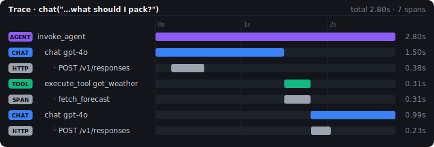

# Monitor

Once a chatlas app reaches production, new questions start to matter: Why is it slow for some users? Which model calls or tool executions dominate latency? Where are errors coming from? What sort of prompts are users entering and [are they getting good responses](../misc/evals.llms.md)?

This is what [OpenTelemetry](https://opentelemetry.io/) (OTel) is designed for. OTel is a vendor-neutral, open standard for collecting telemetry data (traces, metrics, and logs) from an application. Because it’s a standard, you instrument your app once and can then view the resulting data in whatever observability backend you prefer — [Logfire](https://logfire.pydantic.dev/), [Datadog](https://www.datadoghq.com/), [Honeycomb](https://www.honeycomb.io/), [Jaeger](https://www.jaegertracing.io/), and many others all speak OTel. (We’ve been using Logfire internally at Posit while developing this integration.)

Chatlas is instrumented with OTel out of the box, so you don’t have to write any tracing code yourself — you just choose where to send the data.

## Framework-Level Tracing

### What is a trace?

Two concepts cover most of what you need to know:

- A **span** is a single timed unit of work — one model API call, one tool execution — with a name, a start/end time, and key/value **attributes** (token counts, model name, errors, and so on).
- A **trace** is a tree of spans showing the full path of one request through your app, with each span nested under the one that triggered it.

Chatlas emits spans that capture the structure of a multi-turn conversation, including tool execution. A single `chat()` that calls a tool produces a trace shaped like this:

    invoke_agent                      # wraps the full chat loop
    ├── chat gpt-4o                   # each model API call
    ├── execute_tool get_weather      # each tool invocation
    ├── chat gpt-4o                   # follow-up model call
    └── ...

These spans are always emitted, but they go nowhere until you configure a backend to receive them. That’s because chatlas depends only on the lightweight `opentelemetry-api` package, which defines spans without recording them. To actually capture and export traces, you install the OpenTelemetry **SDK** and point it at a destination — which is exactly what the next section does.

### Quick Start: Console Output

The simplest way to see chatlas spans is to print them to the console. Install the OTel SDK via the `otel` extra:

``` bash
pip install "chatlas[otel]"
```

Then configure a console exporter before creating any chats:

``` python
from opentelemetry import trace
from opentelemetry.sdk.trace import TracerProvider
from opentelemetry.sdk.trace.export import ConsoleSpanExporter, SimpleSpanProcessor

provider = TracerProvider()
provider.add_span_processor(SimpleSpanProcessor(ConsoleSpanExporter()))
trace.set_tracer_provider(provider)
```

That’s it — chatlas will automatically emit spans for every `chat()`, `stream()`, and tool invocation.

### A worked example

Here’s a small travel assistant with a `get_weather` tool. The tool opens its own span (`fetch_forecast`) to represent the work it does, and we instrument [`httpx`](https://github.com/encode/httpx) — the HTTP library the provider SDKs use — so the underlying API request shows up too:

``` bash
pip install opentelemetry-instrumentation-httpx
```

``` python
import time
from opentelemetry import trace
from opentelemetry.instrumentation.httpx import HTTPXClientInstrumentor
from chatlas import ChatOpenAI

# Optional: nests the underlying HTTP call under each `chat` span
HTTPXClientInstrumentor().instrument()

tracer = trace.get_tracer("travel_assistant")

def get_weather(city: str) -> str:
    "Get the current weather forecast for a city."
    with tracer.start_as_current_span("fetch_forecast"):
        time.sleep(0.3)  # stand-in for a real forecast lookup
        return f"{city}: 14°C, light rain, breezy this weekend."

chat = ChatOpenAI(
    model="gpt-4o",
    system_prompt=(
        "You are a concise travel assistant. "
        "Always call get_weather before advising what to pack."
    ),
)
chat.register_tool(get_weather)
chat.chat("I'm headed to Tokyo this weekend — what should I pack?")
```

Sent to a backend with a timeline view, the resulting trace looks like this:

[](../images/otel-trace.svg "A trace waterfall showing the invoke_agent span over the full request, two chat gpt-4o spans for the model calls, an execute_tool get_weather span, and the nested POST and fetch_forecast spans underneath them.")

A trace waterfall showing the `invoke_agent` span over the full request, two `chat gpt-4o` spans for the model calls, an `execute_tool get_weather` span, and the nested `POST` and `fetch_forecast` spans underneath them.

Read top to bottom, this is the whole agent loop in one connected trace: the model decides to call the tool, the tool runs (with its own `fetch_forecast` work nested inside `execute_tool`), and a follow-up model call produces the answer. The two `POST` rows are the real HTTP requests, nested under their `chat` spans because chatlas keeps each span active while the provider call is in flight. Drop the `HTTPXClientInstrumentor` line and you’d still get the `invoke_agent`, `chat`, and `execute_tool` spans — just without the HTTP detail.

By default the trace captures this *structure* but not the *message text* — the prompts and responses are omitted unless you opt in (see [Content Capture](#content-capture)). Instrumenting `httpx` is the simplest way to add lower-level HTTP detail; [Lower-level instrumentation](#lower-level-instrumentation) covers the full range of options.

### Production: Logfire

For production observability, we recommend [Pydantic Logfire](https://logfire.pydantic.dev/), which provides a dashboard for exploring traces with minimal setup:

``` bash
pip install logfire
logfire auth
```

``` python
import logfire

logfire.configure()
```

Other OpenTelemetry-compatible backends (Datadog, Honeycomb, Jaeger, etc.) work too — just configure the appropriate exporter via the standard `opentelemetry-sdk` and `opentelemetry-exporter-*` packages.

### Configuration Module Pattern

For apps (especially Shiny apps), extract OTel setup into a dedicated module that runs before any other imports:

``` python
# otel_config.py
import logfire
logfire.configure()
```

``` python
# app.py
import otel_config  # noqa: F401 — side-effect import
from chatlas import ChatOpenAI
# ...
```

### Environment-based configuration

The OpenTelemetry SDK can read its exporter settings from [standard environment variables](https://opentelemetry.io/docs/specs/otel/configuration/sdk-environment-variables/), so you can point chatlas’s traces at a backend without changing code — and without hard-coding the endpoint or its credentials in your app:

``` bash
OTEL_EXPORTER_OTLP_ENDPOINT="https://logfire-eu.pydantic.dev"
OTEL_EXPORTER_OTLP_HEADERS="Authorization=<your-write-token>"
OTEL_SERVICE_NAME="my-chatlas-app"
```

These are read when the SDK is configured from the environment — for example, the zero-code `opentelemetry-instrument` approach [described below](#lower-level-instrumentation) — so the same app can run locally and in production with only its environment changed. Most hosting platforms let you set these per deployment; on [Posit Connect](https://posit.co/products/enterprise/connect/), for instance, you set them as [content environment variables](https://docs.posit.co/connect/user/content-settings/#setting-env-vars).

Some platforms also emit their own OpenTelemetry data. Posit Connect (2026.02.0+) traces the *platform* — request latency, job queues, content execution and deployment — which administrators can export to the same backend. That’s separate from the spans your app emits (Connect doesn’t collect your application’s traces for you), but sending both to one tool puts your chatlas traces alongside the platform activity around them. See Connect’s [OpenTelemetry guide](https://docs.posit.co/connect/admin/opentelemetry/).

### What’s Captured

Chatlas follows the [OpenTelemetry GenAI semantic conventions](https://opentelemetry.io/docs/specs/semconv/gen-ai/), so attribute names (`gen_ai.*`) are consistent with other GenAI-instrumented libraries and are understood by OTel-aware backends out of the box. The lists below are representative rather than exhaustive — see the spec for the full set.

The **agent span** (`invoke_agent`) brackets the whole chat loop and records the provider and requested model (`gen_ai.provider.name`, `gen_ai.request.model`).

Each **chat span** (one per model API call) records:

- Provider and requested model (`gen_ai.provider.name`, `gen_ai.request.model`)
- Token usage (`gen_ai.usage.input_tokens`, `gen_ai.usage.output_tokens`)
- Response model and ID (`gen_ai.response.model`, `gen_ai.response.id`)
- Optionally, the message content itself (system prompt, input messages, output messages) — see [Content Capture](#content-capture) below

Each **tool span** (`execute_tool`, one per tool invocation) records:

- Tool name, description, and call ID (`gen_ai.tool.name`, `gen_ai.tool.description`, `gen_ai.tool.call.id`)
- Errors, if the tool raises (`error.type`, plus the exception is recorded on the span)

### Content Capture

Message content is **not** captured by default (it may contain sensitive data). To enable:

``` bash
export OTEL_INSTRUMENTATION_GENAI_CAPTURE_MESSAGE_CONTENT=true
```

## Lower-Level Instrumentation

Chatlas’s framework spans describe the *shape* of a conversation — the agent loop, each model call, each tool. To also capture what happens *inside* each step (the raw HTTP request, SDK-level retries, full request/response payloads), you add a lower-level instrumentor.

You don’t have to do anything special to connect these to chatlas. Because chatlas keeps each span active while the call is in flight, spans created by other libraries nest underneath automatically:

- A transport- or SDK-level **HTTP span** appears under the relevant `chat` span.
- Any spans your **tools** emit (e.g. a database query or outbound request) appear under that tool’s `execute_tool` span.

The result is one connected trace spanning the agent loop, each model call, each tool execution, and the underlying detail — exactly the trace shown in [the worked example](#a-worked-example) above.

The options range from most general to most provider-aware:

- **Transport level — `httpx`.** What the worked example used. It’s the simplest, lowest-dependency option and works with every provider, since all of chatlas’s provider SDKs make their requests through [`httpx`](https://github.com/encode/httpx). The tradeoff is that the spans are generic HTTP (method, URL, status) with no GenAI-specific attributes.
- **Model-agnostic, SDK level — OpenLLMetry.** One library that adds GenAI-aware spans across many providers at once.
- **Official, per-provider libraries.** One instrumentor per SDK, matched to the provider you’re using.

The SDK-level options are covered below.

### OpenLLMetry

The most convenient way to get GenAI-aware spans across many providers at once is [openllmetry](https://github.com/traceloop/openllmetry), which can be as easy as adding the following code to your app:

``` bash
pip install traceloop-sdk
```

``` python
from traceloop.sdk import Traceloop

Traceloop.init(
  app_name="my app name",
  disable_batch=True,
  telemetry_enabled=False
)
```

From here, a quick and easy way to get started visualizing your app’s telemetry data is to sign up for a (free) [Traceloop](https://traceloop.com/) account. Openllmetry does, however, [integrate with many other observability platforms](https://www.traceloop.com/docs/openllmetry/integrations/introduction). If you want to avoid the Traceloop Python SDK, you can also use these OTel instrumentation libraries from the openllmetry project more directly (e.g., [openai](https://github.com/traceloop/openllmetry/tree/main/packages/opentelemetry-instrumentation-openai) and [anthropic](https://github.com/traceloop/openllmetry/tree/main/packages/opentelemetry-instrumentation-anthropic)).

### Official OpenTelemetry Libraries

Alternatively, the OpenTelemetry project (and its contributors) maintain instrumentation packages for individual provider SDKs. These give you more direct control than OpenLLMetry, at the cost of installing and enabling one package per SDK you use. Since each chatlas provider wraps a specific SDK, pick the instrumentor that matches the SDK behind your provider, as described below.

### OpenAI

More than a handful of chatlas’ [model providers](../get-started/models.llms.md) use the [openai](https://pypi.org/project/openai/) Python SDK under the hood (e.g., `ChatOpenAI`, `ChatOllama`, etc).

> **TIP:**
>
> To be sure a particular provider uses the `openai` SDK, make sure the class of the `.provider` attribute is `OpenAIProvider`:
>
> ``` python
> from chatlas import ChatOpenAI
> chat = ChatOpenAI()
> chat.provider
> # <chatlas._openai.OpenAIProvider object at 0x103d2fdd0>
> ```

As a result, you can use the [opentelemetry-instrumentation-openai-v2](https://github.com/open-telemetry/opentelemetry-python-contrib/tree/main/instrumentation-genai/opentelemetry-instrumentation-openai-v2) package to add OTel instrumentation your app. It even provides a way to add instrumentation without modifying your code (i.e., zero-code). To tweak [the zero-code example](https://github.com/open-telemetry/opentelemetry-python-contrib/tree/main/instrumentation-genai/opentelemetry-instrumentation-openai-v2/examples/zero-code) to work with chatlas, just change the `requirements.txt` and `main.py` files to use chatlas instead of openai directly:

`main.py`

``` python
from chatlas import ChatOpenAI
chat = ChatOpenAI()
chat.chat("Hello world!")
```

You may also want to tweak the environment variables in `.env` to target the relevant OTel collector and service name.

### Anthropic

Both the `ChatAnthropic()` and `ChatBedrockAnthropic()` providers use the [anthropic](https://pypi.org/project/anthropic/) Python SDK under the hood. As a result, you can use the [opentelemetry-instrumentation-anthropic](https://github.com/traceloop/openllmetry/tree/main/packages/opentelemetry-instrumentation-anthropic) package to add OTel instrumentation your app.

To do this, you’ll need to install the package:

``` bash
pip install opentelemetry-instrumentation-anthropic
```

Then, add the following instrumentation code to your app:

``` python
from opentelemetry.instrumentation.anthropic import AnthropicInstrumentor
AnthropicInstrumentor().instrument()
```

### Google

Both the `ChatGoogle()` and `ChatVertex()` providers use the [google-genai](https://pypi.org/project/google-genai/) Python SDK under the hood. As a result, you can use the [opentelemetry-instrumentation-google-genai](https://github.com/open-telemetry/opentelemetry-python-contrib/tree/main/instrumentation-genai/opentelemetry-instrumentation-google-genai) package to add OTel instrumentation your app. It even provides a way to add instrumentation without modifying your code (i.e., zero-code). To tweak [the zero-code example](https://github.com/open-telemetry/opentelemetry-python-contrib/tree/main/instrumentation-genai/opentelemetry-instrumentation-google-genai/examples/zero-code) to work with chatlas, just change the `requirements.txt` and `main.py` files to use chatlas instead of google-genai directly:

`main.py`

``` python
from chatlas import ChatGoogle
chat = ChatGoogle()
chat.chat("Hello world!")
```

As with the OpenAI example, you may also want to tweak the environment variables in `.env` to target the relevant OTel collector and service name.
