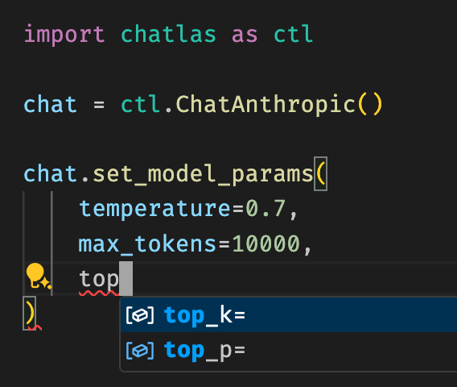
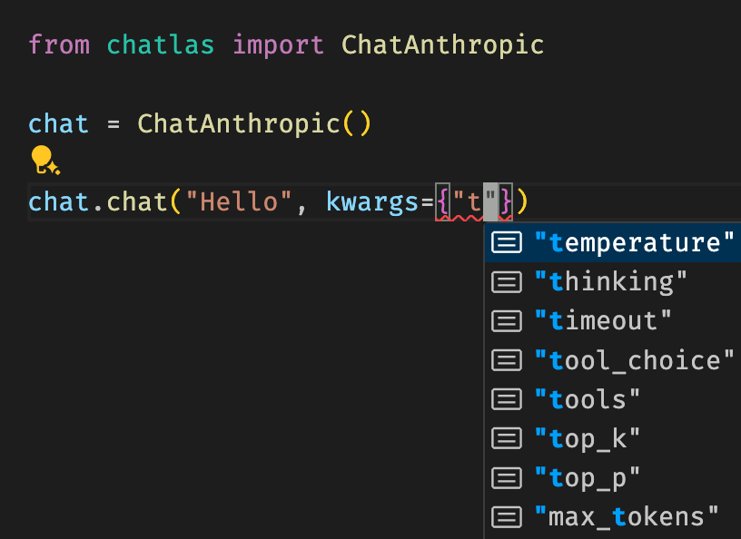
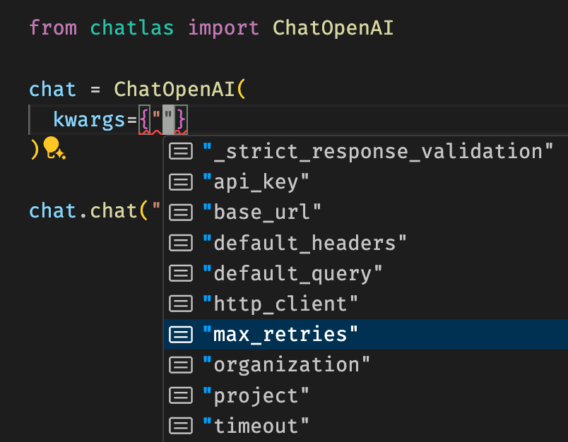

# Parameters

There are a few different classes of custom parameters that you can set when using chatlas.

The first, and most important, are [model parameters](#model-parameters) that are commonly used across providers. This includes parameters like `temperature`, `top_p`, and `max_tokens`. The second is [chat parameters](#chat-parameters), which are specific to the model provider you’re using. This might include non-standard parameters like `thinking` or provider-specific built-in `tools`. Finally, there are [HTTP parameters](#http-parameters), which are used to customize the behavior of the HTTP client make requests for the duration of the chat session.

In any case, chatlas leverages typing and IDE autocomplete to help you discover and set these parameters in a type safe way.

## Model parameters

The [`.set_model_params()`](../reference/Chat.llms.md#set_model_params.qmd) method allows you to set standard model parameters that most providers support. This is nice for quickly setting parameters that are commonly used (e.g., `temperature`, `max_tokens`, etc.) in a provider-agnostic way. Also note that these parameters persist across future calls to the model, so you don’t have to set them every time you make a request. To revert to the default parameter value, pass `None` to the relevant parameter.

Screenshot of setting common model parameters

## Chat parameters

If you’re using a method like [`.chat()`](../get-started/chat.llms.md) or [`.stream()`](../get-started/stream.llms.md) to submit input to a model, you can include a dictionary of provider-specific chat parameters via the `kwargs` parameter. Some of these may overlap with the model parameters, but you’ll also find other provider-specific parameters that are unique to the model provider you’re using. Assuming your IDE has autocomplete / typing support, provider-specific parameters are shown as you type in keys and values can be type checked.

Screenshot of IDE with typing support showing available parameters for model provider

## HTTP parameters

When you initialize a `Chat` client, you can pass in a dictionary of HTTP parameters via the `kwargs` parameter. These parameters are used to customize the behavior of the HTTP client used to communicate with the model provider. This can be useful for things like setting the timeout, number of retries, and other HTTP client-specific settings.

Screenshot of IDE with typing support showing available parameters for HTTP client
